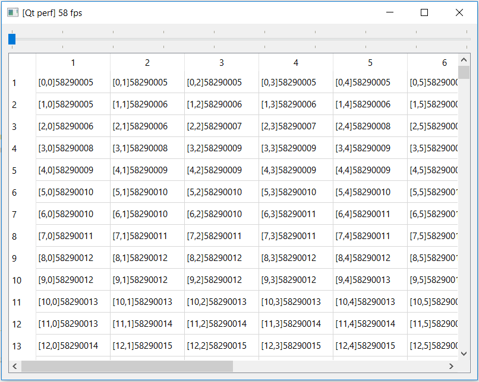
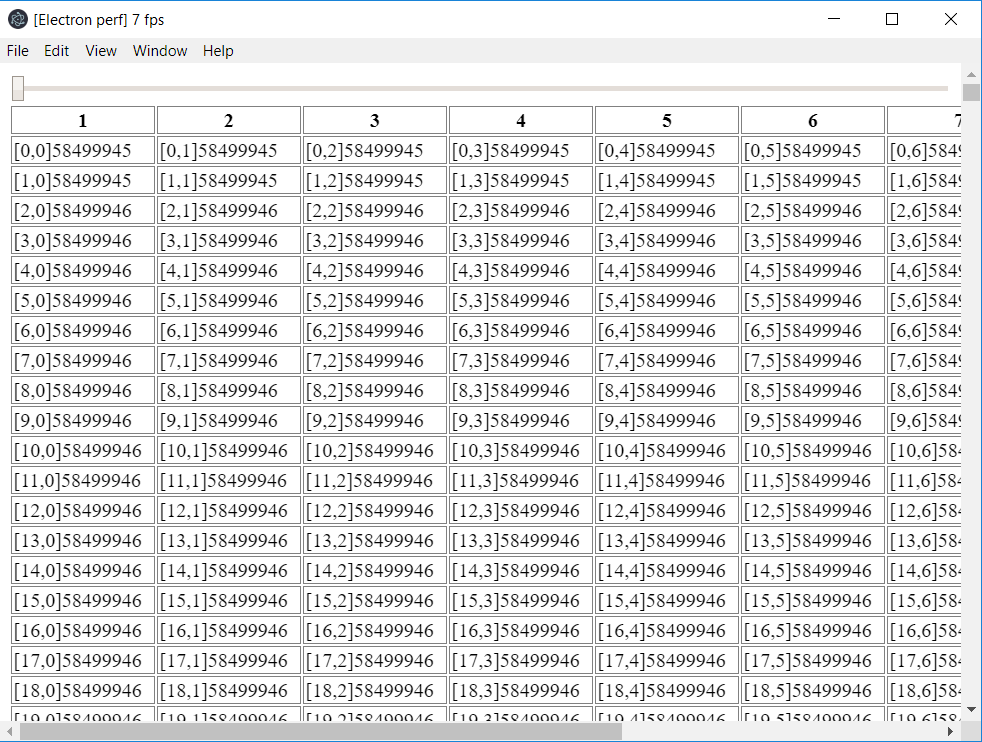

# electron-perf

__Electron__ vs __Qt__ perf. comparison.

This is __Electron__ part.

## Install & Run

1. npm install
2. npm start
3. FPS should be printed in window title

## Results

In case of huge DOM __Qt__ ~10 times better than __Electron__.

